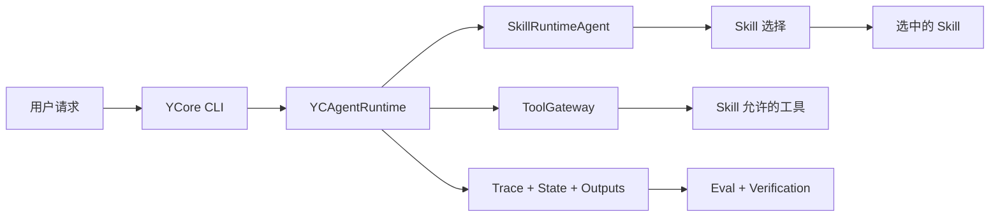

# YCore

`YCore` 是一个通用的 skill-driven 本地 Agent Harness，面向中文用户，用 CLI 把 Skill 选择、工具边界、workspace/context、memory、trace/state、eval 和 verification 串成可复盘的工程闭环。

YCore 不把业务方向写死在全局 prompt 里。具体落地方向由 Skill 决定：装什么 Skill，就验证什么类型的 Agent workflow。全局运行时只负责受控执行：选择合适的 Skill、注入上下文、通过 ToolGateway 调用工具、记录过程证据，并把结果交给 eval 与 verification 检查。

## 项目定位

YCore 的核心目标是验证一套通用 Agent Harness 是否能支撑不同领域 Skill：Skill 如何被发现和选择、工具如何被管控、上下文如何注入、过程如何记录、结果如何评测。

当前仓库默认发布三个示例业务 Skill，它们是第一批验证 Skill：

- `code-review`：验证本地项目审查类 workflow，要求读取代码证据、追关键链路、识别风险和测试缺口。
- `eval-writer`：验证 Agent eval 设计类 workflow，要求把评测目标拆成 deterministic eval、真实模型 smoke eval 和人工 rubric。
- `ycore-analytics`：验证 workspace-local SQLite analytics 和只读 MCP 查询 workflow，要求用运行元数据、工具事件、verification 和 eval 结果回答运行健康度问题。

后续可以继续加入其他领域 Skill，用同一套 Harness 验证新的落地方向。

## CLI 主线

运行：

```powershell
python main.py
```

CLI 采用 Textual TUI。顶部显示当前工作区、模型、估算上下文占用、Git 分支和 session 编号；左侧工作台栏显示可操作的 Workspace 与 Sessions；中间保留对话 transcript、Assistant 回复和可折叠执行过程；底部是一行输入框和 `/command` 补全。常用命令：

- `/session`：查看或切换当前 workspace 的会话。
- `/session new <title>`：创建新会话。
- `/workspace`：查看或切换工作区。
- `/workspace add <path>`：添加一个已有目录作为工作区。
- `/status`：查看当前状态。
- `/stop`：停止当前正在处理的任务。
- `/skills`：查看当前可用技能。
- `/clear`：清空当前屏幕内容，不删除 session 记忆。
- `Ctrl+B`：显示或隐藏左侧 Workspace/Sessions 工作台栏。

## 默认 Skill

当前默认发布三个示例业务 Skill：

- `code-review`：项目体检和变更审查，重点是代码证据、调用链、风险分级、测试缺口和最小验证。
- `eval-writer`：为 Agent workflow、工具边界、trace/state、verification 和输出质量设计评测方案。
- `ycore-analytics`：查询当前 workspace 的 SQLite analytics，分析运行情况、工具失败、verification、eval 通过率和 denied 工具事件。

具体工作流放在 Skill 中，不写入全局 prompt。

## 默认工具

默认 CLI runtime 暴露通用工具，具体是否使用由选中的 Skill 决定：

- `workspace_files`：列出当前工作区可读文件。
- `file_reader`：读取代码、配置、Markdown、PDF 和 `.docx` 需求或规格文档。
- `code_search`：搜索符号、调用点、配置项和测试覆盖。
- `git_inspector`：只读查看 status、diff、commit、本地 refs 和 blame。
- `verification_runner`：运行白名单内的最小验证命令。
- `markdown_writer`：在用户要求保存时写入 Markdown 输出。
- `rag_search`：可选本地上下文检索。
- `web_search`：用户明确需要外部或最新信息时使用。

## 核心能力

- 从 `SKILL.md` 加载技能，并把技能作为可维护资产。
- 通过 `SkillRuntimeAgent` 做技能候选发现、选择和执行。
- 通过 `PromptBuilder` 集中组装运行时协议、项目指令和模式协议。
- 支持工作区根目录 `YCORE.md` 与本地 `.ycore/YCORE.md` 两层项目指令。
- 通过 `ToolGateway` 管理工具权限、参数校验、审批边界和追踪记录。
- 在当前 workspace 的 `.ycore/runs/` 下写入输入、输出、trace 和 state checkpoint。
- 可选 SQLite analytics：把当前 workspace 的 Agent 运行元数据、工具事件、verification 和 eval 结果写入 `.ycore/sqlite/analytics.sqlite`，并通过只读 SQLite MCP 工具供 `ycore-analytics` 查询。
- 用 eval runner 与 VerificationGate 把“模型说完成”转成可检查证据。

## 当前 Eval 基线

当前有效 eval 基线是 `20260630-211458` 这次真实模型运行。之前的 eval 记录只作为开发历史，不再作为当前质量口径。

这次基线使用 active workspace `E:\code\Ycore-demo`，跑完了 `code-review`、`eval-writer`、`runtime`、`toolgateway` 和 `context` 五组 cases，并在 `outputs/eval/` 下生成带时间戳的 JSON 报告。对应 trace/state/final_output 证据写在 active workspace 的 `.ycore/runs/` 下。

详细说明见：

- [docs/evaluation-report.md](docs/evaluation-report.md)：当前 eval 口径、指标解释和复跑方式。
- [docs/eval-run-20260630-211458.md](docs/eval-run-20260630-211458.md)：本次真实运行的结果、失败分类和可展示 artifact。

这次结果不是一个简单的“通过率”故事：Skill 选择、state checkpoint 和 forbidden tool 边界表现稳定；主要缺口集中在 required tool discipline、工具 schema、工具预算、verification 调用和输出结构弱匹配。

## 架构



更多边界说明见 [docs/architecture.md](docs/architecture.md)。

## 根目录 `ycore.json`

YCore 采用单一的非密钥配置模型。必需的全局配置放在项目或安装根目录的 `ycore.json`；workspace 级覆盖配置是可选的，位置固定为 `<workspace>/.ycore/ycore.json`。

`.env` 和 `.env.example` 只用于密钥，例如 `DEEPSEEK_API_KEY`、`MIMO_API_KEY` 和 `TAVILY_API_KEY`。模型选择、provider base URL、模型超时、上下文窗口、请求默认参数、工具、Skill、analytics、memory、MCP server 和 JSON 协议策略等运行时配置都应放在 `ycore.json` 中。

Workspace 状态不存放在 `ycore.json` 中。CLI 的 workspace 注册表仍然保存在 `data/workspaces.json`，每个 workspace 自己的元数据保存在 `.ycore/workspace.json`。

如果全局 `ycore.json` 缺失，YCore 会给出明确错误并停止启动。它不会再从 `LLM_*` 或 `YCORE_ANALYTICS_*` 这类环境变量中恢复非密钥运行时配置。

模型参数存放在 `models.providers.<provider>.models[]` 下。`contextWindow` 是 YCore 用于上下文展示和预算估算的元数据；`maxOutputTokens` 是语义元数据；`request` 存放默认的 OpenAI 兼容 API 请求参数，例如 `max_tokens`、`temperature` 和 `top_p`。单次调用传入的参数仍然优先于 `request` 默认值。

`structuredOutput` 是模型级可选配置。启用后，YCore 只会在协议 JSON 调用中应用它的 `request` 字段，例如 Skill 选择、工具调用、最终回答和 JSON 修复。它用于 provider 的 JSON mode 配置，例如 `{"response_format":{"type":"json_object"}}`，不代表启用 function calling。

默认 runtime 策略是在模型输出不符合协议 JSON 时重试一次；如果重试后仍然无效，本次运行会失败。

## 快速开始

| 任务 | 命令 |
| --- | --- |
| 创建虚拟环境 | `python -m venv .venv` |
| 安装依赖 | `pip install -r requirements.txt` |
| 运行 CLI | `python main.py` |
| 运行测试 | `python -m pytest --basetemp .\.pytest-tmp -q` |
| 运行本地检查 | `powershell -ExecutionPolicy Bypass -File .\scripts\test.ps1` |
| 运行离线 eval demo | `python scripts/demo_eval_run.py` |

如果当前 shell 没有激活仓库虚拟环境，请优先使用：

```powershell
.\.venv\Scripts\Activate.ps1
```

如果被评估的 active workspace 自己依赖 `.venv`，它的验证命令也应使用该 workspace 的解释器，而不是全局 Python。

## 项目结构

- `main.py`：CLI 入口和运行时装配。
- `yc_agents/agents`：Agent 编排逻辑。
- `yc_agents/cli`：终端交互界面、session 和 workspace 命令。
- `yc_agents/eval`：评测 case、runner、metrics 和 report。
- `yc_agents/harness`：运行时、权限、追踪、状态、verification 和工具网关。
- `yc_agents/prompts`：集中 prompt 组装和项目指令加载。
- `yc_agents/rag`：可选的本地上下文检索基础设施。
- `yc_agents/skills`：技能定义、加载、发现和注册表。
- `yc_agents/tools`：具体工具实现和工具注册表。
- `eval/cases`：当前验证 Skill 的 deterministic、real smoke 和 manual rubric cases。
- `outputs/eval`：eval runner 输出的 JSON 结果，当前有效基线使用 `20260630-211458-*`。
- `skills`：面向用户发布的 Skill。
- `tests`：Python 单元测试。

## 当前边界

- 当前只保留 CLI 端。
- 默认发布 `code-review`、`eval-writer` 和 `ycore-analytics` 三个示例业务 Skill。
- 领域能力由 Skill 决定，YCore 全局层保持通用。
- 保留通用 `.docx` 文件读取能力，方便读取需求或规格文档。
- RAG 是可选 context infrastructure，不是固定产品故事。
