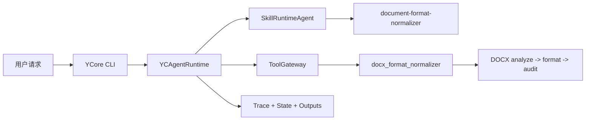

# YCore

`YCore` 是一个本地运行的 CLI Agent 工程原型。它的首个落地点：Word 文档格式调整。

项目当前只保留 CLI 端和一个内置技能 `document-format-normalizer`。用户可以把格式混乱的 `.docx` 草稿交给 YCore，让它调用确定性的 DOCX 工具完成分析、格式重建和审计报告输出，而不是只依赖模型口头说明。

## 首个落地点：Word 文档格式调整

第一版围绕一个清晰场景展开：

> 我有一份 Word 草稿，需要按指定模板或内置报告标准统一格式，并生成一份可以复核的格式审计报告。

这个落地点覆盖：

- 读取 `.docx` 草稿。
- 识别标题、正文、表格、题注和可提取图片。
- 加载内置 `report-standard` 模板，或读取上传模板中的部分规则。
- 生成规范化后的 `.docx` 文件。
- 输出 Markdown/JSON 审计报告，标出通过项和需要人工复核的 warning。

## CLI 主线

运行：

```powershell
python main.py
```

CLI 顶部会显示当前工作区、模型、估算上下文占用、Git 分支和 session 编号。常用命令：

- `/session`：查看或切换当前 workspace 的会话。
- `/session new <title>`：创建新会话。
- `/workspace`：查看或切换工作区。
- `/workspace add <path>`：添加一个已有目录作为工作区。
- `/status`：查看当前状态。
- `/stop`：停止当前正在处理的任务。
- `/skills`：查看当前可用技能。
- `/clear`：清空当前屏幕内容，不删除 session 记忆。

## 联网搜索

YCore 提供通用工具 `web_search`，第一版底层使用 Tavily。将 API key 写入 `.env`：

```env
TAVILY_API_KEY=你的 Tavily key
```

在 CLI 中可以直接询问需要最新信息的问题，Agent 会在需要时调用 `web_search`。

## 可用 Skill

当前项目只随仓库发布一个技能：

- `document-format-normalizer`：Word 文档格式调整。

技能文件位于：

```text
skills/document-format-normalizer/SKILL.md
```

相关参考资料和脚本位于：

```text
skills/document-format-normalizer/references/
skills/document-format-normalizer/scripts/
skills/document-format-normalizer/assets/
```

## 示例请求

```text
使用 document-format-normalizer 处理 draft.docx，按 report-standard 模板调整格式，输出名为 normalized-report。
```

生成文件默认写入当前工作区：

```text
.ycore/docx-format/
```

典型输出包括：

- `normalized-report.docx`
- `normalized-report.audit.md`
- `normalized-report.audit.json`

## 核心能力

- 从 `SKILL.md` 加载技能，并把技能作为可维护的文件系统资产。
- 通过 `SkillRuntimeAgent` 做运行时技能选择。
- 通过 `ToolGateway` 统一管理工具权限、参数校验、审批边界和追踪记录。
- 通过 `docx_format_normalizer` 工具执行确定性的 Word 分析、生成和审计。
- 在当前 workspace 的 `.ycore/runs/` 下写入输入、输出、trace 和 state checkpoint。
- 支持 workspace 与 session 隔离。

## 架构



更多边界说明见 [docs/architecture.md](docs/architecture.md)。

## 快速开始

| 任务 | 命令 |
| --- | --- |
| 创建虚拟环境 | `python -m venv .venv` |
| 安装依赖 | `pip install -r requirements.txt` |
| 运行 CLI | `python main.py` |
| 运行测试 | `python -m pytest -q` |
| 运行本地检查 | `powershell -ExecutionPolicy Bypass -File .\scripts\test.ps1` |

## 项目结构

- `main.py`：CLI 入口和运行时装配。
- `yc_agents/agents`：Agent 编排逻辑。
- `yc_agents/cli`：终端交互界面、session 和 workspace 命令。
- `yc_agents/docx_format`：Word 文档分析、模板规则、格式生成、审计和 pipeline。
- `yc_agents/harness`：运行时、权限、追踪、状态和工具网关。
- `yc_agents/skills`：技能定义、加载、发现和注册表。
- `yc_agents/tools`：具体工具实现和工具注册表。
- `skills/document-format-normalizer`：面向用户的 Word 文档格式调整技能。
- `tests`：Python 单元测试。

## 当前边界

- 当前只保留 CLI 端。
- 当前只发布 `document-format-normalizer` 一个技能。
- 第一版重点保证 `report-standard` 内置模板稳定可演示。
- 上传模板只提取可稳定读取的部分规则。
- 复杂 Word 对象不会承诺完美重建，会进入审计报告 warning。
