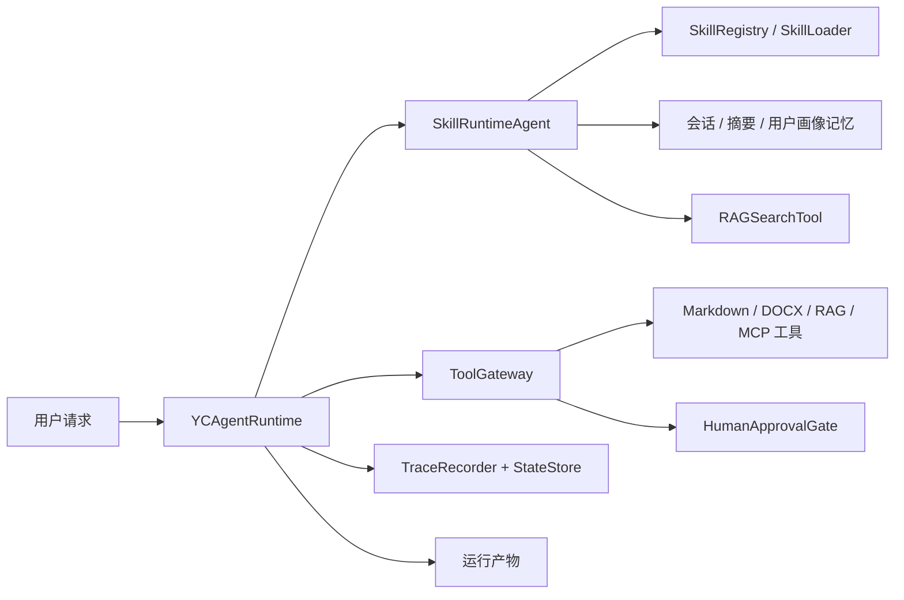

# YCore

## CLI 主线

当前开发主线是 CLI。运行 `python main.py` 会启动全屏终端界面，顶部固定显示工作区、模型、估算上下文占用、Git 分支和 session 编号。桌面端代码仍保留在仓库中，但暂时不作为主要开发入口。

CLI 状态栏字段：

- `Workspace`: 当前工作路径。
- `Model`: 当前 LLM 配置中的模型名。
- `Context`: 本地估算的上下文占用，带 `est` 标记。
- `Branch`: 当前 Git 分支，非 Git 目录时显示 `no-git`。
- `Session`: 当前 CLI 会话编号。

CLI 支持 workspace 和 session 隔离。YCore 代码仍从本仓库运行，但可以通过 `/workspace` 进入其他工作区；每个工作区会自动创建自己的 `.ycore` 目录，用来保存该工作区的 sessions、记忆和 run 产物。

常用 CLI 命令：

- `/session`: 打开当前 workspace 的 session 列表，用上下键选择并切换。
- `/session new`: 新建一个默认命名 session。
- `/session new 开题报告`: 新建名为“开题报告”的 session。
- `/session session_xxx`: 切换到指定 session。
- `/session delete`: 删除当前 session，确认后会删除它的记忆和 runs。
- `/workspace`: 打开已登记 workspace 列表，用上下键选择并切换。
- `/workspace add E:\paper-project`: 添加并切换到一个已存在的目录。
- `/workspace workspace_xxx`: 切换到指定 workspace。
- `/workspace current`: 查看当前 workspace。
- `/workspace delete`: 删除当前 workspace 的 `.ycore` 状态并移除索引，确认后不会删除普通项目文件。
- `/clear`: 只清空当前屏幕聊天框，不删除 session 记忆。
- `/status`: 查看当前状态。
- `/stop`: 停止当前正在处理的任务，CLI 保持可继续输入。
- `/skills`: 查看当前可用技能名称。

输入 `/` 时会出现命令提示，方向键选择，`Tab` 补全，`Enter` 执行当前输入的命令。

## 项目是什么

`YCore` 是一个面向研究生科研流程的 Skill 驱动研究 Agent。它主要服务开题报告、文献综述、资料整理、系统设计和研究方案拆解等场景，也可以作为一个展示 Agent 运行时工程能力的项目。

这个项目的重点不是“把提示词写长”，而是把一次研究任务拆进清晰的运行边界里：技能选择、检索增强、工具调用、记忆管理、人工审批、状态保存、执行追踪和结果验证。

## 为什么它是 Agent 项目

它不是单轮聊天机器人。一次用户请求可以触发技能发现、RAG 检索、工具调用、记忆更新、审批检查、执行追踪、状态恢复和最终回答生成。

我希望通过这个项目回答一个工程问题：当一个研究任务变长、变复杂之后，Agent 应该怎样在可控、可观察、可恢复的运行时里完成任务，而不是只依赖一次模型输出。

## 核心能力

- 从 `SKILL.md` 加载技能，并把技能作为可维护的文件系统资产。
- 通过 `SkillRuntimeAgent` 做运行时技能选择，先进行 top-k 元数据发现，再进入完整技能执行。
- 提供 RAG 检索工具，支持元数据分块、测试用确定性本地 embedding、关键词/向量混合检索、重排序和引用格式化。
- 使用 `ToolGateway` 统一管理工具权限、允许列表和人工审批。
- 支持会话记忆、摘要记忆和用户画像记忆。
- 在当前 workspace 的 `.ycore/runs/<session_id>/<run_id>` 下写入 trace 和 state checkpoint，便于调试、复盘和解释。
- 支持从已保存用户输入中保守恢复任务，并允许追加重定向指令。
- 提供 FastAPI 后端和 Electron 桌面端壳层。

## 架构



组件边界和当前限制见 [docs/architecture.md](docs/architecture.md)。

## 快速开始

| 任务 | 命令 |
| --- | --- |
| 安装 Python 依赖 | `pip install -r requirements.txt` |
| 运行 CLI | `python main.py` |
| 运行后端 | `python -m uvicorn yc_agents.desktop.app:app --reload` |
| 运行 Python 测试 | `python -m pytest -q` |
| 运行桌面端测试 | `cd desktop; npm test -- --run` |
| 构建桌面端 | `cd desktop; npm run build` |
| 运行本地完整检查 | `powershell -ExecutionPolicy Bypass -File .\scripts\test.ps1` |

创建虚拟环境并运行 CLI：

```powershell
python -m venv .venv
.\.venv\Scripts\Activate.ps1
pip install -r requirements.txt
python main.py
```

运行桌面端后端和前端：

```powershell
python -m uvicorn yc_agents.desktop.app:app --reload
cd desktop
npm install
npm run dev
```

运行测试：

```powershell
python -m pytest -q
cd desktop
npm test -- --run
```

## 演示场景

1. “帮我围绕多智能体论文助手写一个开题报告大纲。”
2. “读取这份材料，整理研究背景、问题定义和技术路线。”
3. “基于已有资料检索证据，并生成带引用的文献综述片段。”

## 评估与验证

项目内置 30 条研究 Agent 评估用例，位于 `eval/cases/research_agent_cases.jsonl`。评估 runner 会记录任务输出和延迟，并为后续工具调用、检索质量和引用质量指标扩展留出位置。

RAG 专项评估用例位于 `eval/cases/rag_cases.jsonl`，用于检查检索、重排序和引用格式化链路。

## 项目结构

- `main.py`：CLI 入口和运行时装配。
- `yc_agents/agents`：Agent 编排逻辑。
- `yc_agents/harness`：运行时、权限、追踪、状态和工具网关。
- `yc_agents/skills`：技能定义、加载、top-k 发现和注册表。
- `yc_agents/rag`：加载器、元数据分块、embedding provider、关键词/向量存储、混合检索、重排序和引用格式化。
- `yc_agents/tools`：具体工具实现和工具注册表。
- `mcp_servers.json`：演示用 filesystem MCP server 配置。
- `yc_agents/desktop`：桌面端使用的 FastAPI 后端。
- `desktop`：Electron、React 和 TypeScript 桌面 UI。
- `tests`：Python 单元测试。

## 项目要点

- 项目把模型提示词和运行时控制分开，突出 Agent 工程而不是单次 prompt。
- 工具调用必须经过 `ToolGateway`，权限、审批和追踪都有明确边界。
- 技能是由 `SKILL.md` 描述的文件系统资产，便于扩展、审查和复用。
- 运行时会写入 trace 和 state，方便调试、复盘和解释任务过程。
- RAG、MCP、resume、桌面端观测和评估 harness 共同展示了一个 Agent 项目从 demo 走向可验证系统的路径。

## 后续路线

- 扩展评估指标，增加工具调用正确率、检索命中率、引用质量和任务成功率统计。
- 增加语料导入命令，形成可复现的 RAG 检索与引用报告。
- 强化 `ToolGateway` 的结构化校验、超时、重试和循环控制。
- 将当前基于用户输入回放的 resume，扩展为更完整的中断任务恢复。
- 扩展 filesystem MCP 集成，让它从静态配置和测试边界走向更多真实工具场景。
