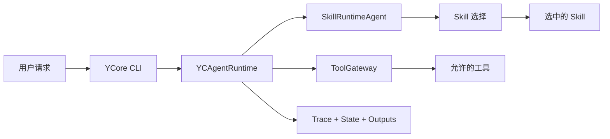

# YCore

`YCore` 是一个面向中文用户的本地 CLI Agent 工程原型。它的核心目标是把用户请求路由到合适的 Skill，并在受控的工具、工作区、记忆和运行记录边界内完成任务。

项目不把某个具体落地场景写死进全局角色设定。具体能力由 `skills/` 下的 Skill 决定；全局运行时只负责技能选择、上下文注入、工具调用协议、权限和可复核输出。

## CLI 主线

运行：

```powershell
python main.py
```

CLI 顶部会显示当前工作区、模型、估算上下文占用、Git 分支和 session 编号。常用命令：

- `/session`：查看或切换当前 workspace 的会话。
- `/session new <title>`：创建新会话。
- `/workspace`：查看或切换工作区。
- `/workspace add <path>`：添加一个已有目录作为工作区。
- `/status`：查看当前状态。
- `/stop`：停止当前正在处理的任务。
- `/skills`：查看当前可用技能。
- `/clear`：清空当前屏幕内容，不删除 session 记忆。

## 默认 Skill

当前仓库默认发布两个示例业务 Skill：

- `code-review`：审查项目结构、架构、风险和测试缺口。
- `eval-writer`：为项目、Agent、工具或功能设计 eval case、指标、测试数据和评估流程。

这两个 Skill 是示例业务能力，不是全局 prompt 的默认身份。后续可以继续添加新的 Skill，让具体工作流留在 Skill 层，而不是写进 YCore 的全局角色设定。

## 通用工具

默认 CLI runtime 暴露通用工具：

- `workspace_files`：列出当前工作区可读文件。
- `file_reader`：读取工作区内支持的文件内容。
- `markdown_writer`：写入 Markdown 输出。
- `rag_search`：检索已加载的本地知识片段。
- `web_search`：检索需要当前或外部信息的问题。

将 Tavily API key 写入 `.env` 后可使用联网搜索：

```env
TAVILY_API_KEY=你的 Tavily key
```

## 核心能力

- 从 `SKILL.md` 加载技能，并把技能作为可维护的文件系统资产。
- 通过 `SkillRuntimeAgent` 做运行时技能选择和执行。
- 通过 `PromptBuilder` 集中组装全局运行时协议、项目指令和模式协议。
- 支持工作区根目录 `YCORE.md` 与本地 `.ycore/YCORE.md` 两层项目指令。
- 通过 `ToolGateway` 统一管理工具权限、参数校验、审批边界和追踪记录。
- 在当前 workspace 的 `.ycore/runs/` 下写入输入、输出、trace 和 state checkpoint。
- 支持 workspace 与 session 隔离。

## 架构



更多边界说明见 [docs/architecture.md](docs/architecture.md)。

## 快速开始

| 任务 | 命令 |
| --- | --- |
| 创建虚拟环境 | `python -m venv .venv` |
| 安装依赖 | `pip install -r requirements.txt` |
| 运行 CLI | `python main.py` |
| 运行测试 | `python -m pytest -q` |
| 运行本地检查 | `powershell -ExecutionPolicy Bypass -File .\scripts\test.ps1` |

## 项目结构

- `main.py`：CLI 入口和运行时装配。
- `yc_agents/agents`：Agent 编排逻辑。
- `yc_agents/cli`：终端交互界面、session 和 workspace 命令。
- `yc_agents/harness`：运行时、权限、追踪、状态和工具网关。
- `yc_agents/prompts`：集中 prompt 组装和项目指令加载。
- `yc_agents/skills`：技能定义、加载、发现和注册表。
- `yc_agents/tools`：具体工具实现和工具注册表。
- `yc_agents/docx_format`：保留的底层 DOCX 处理包，可供未来可选 Skill 使用。
- `skills`：面向用户发布的 Skill。
- `tests`：Python 单元测试。

## 当前边界

- 当前只保留 CLI 端。
- 默认发布 `code-review` 和 `eval-writer` 两个示例业务 Skill。
- 具体工作流应放在 Skill 中，不写入全局 prompt。
- 底层 DOCX 处理代码暂时保留，但不作为默认运行时工具暴露。
