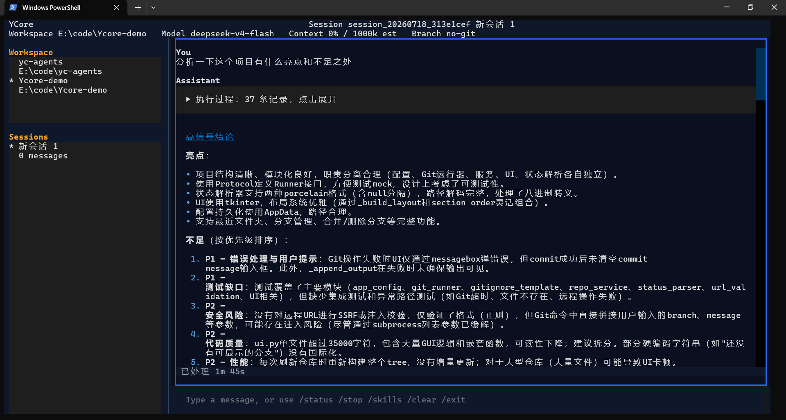
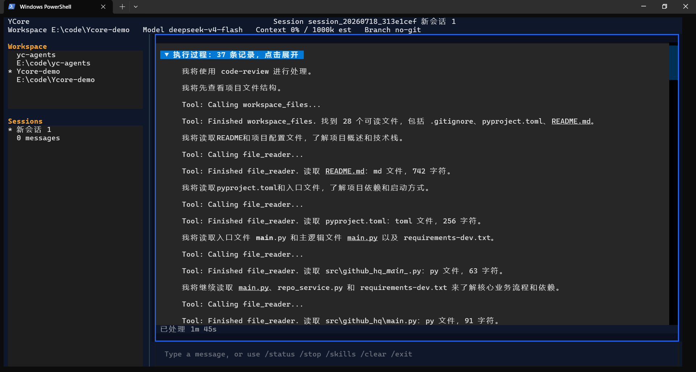
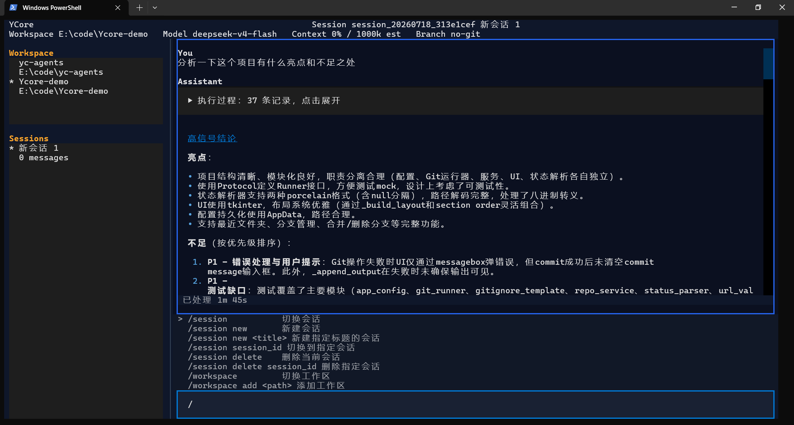
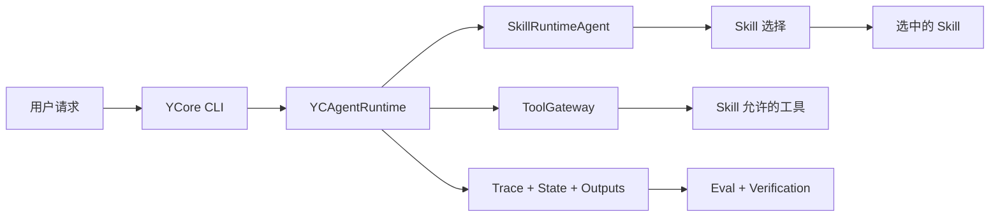

# YCore 🧩

`YCore` 是项目名称。YCore 是一个通用的 skill-driven 本地 Agent Harness，面向中文用户，通过 CLI 将 Skill 选择、工具边界、Workspace Context、Memory、Trace/State、Eval 与 Verification 串成可复盘的工程闭环。


YCore 不把业务方向写死在全局 Prompt 中，具体落地方向由 Skill 决定。安装什么 Skill，就验证什么类型的 Agent Workflow；全局 Runtime 只负责受控执行、上下文注入、工具调用、过程留痕，以及结果评测与验证。

## 📷 界面预览

### 项目审查结果



YCore 根据本地代码证据输出项目亮点、风险分级和测试缺口。

## 📋 目录

- [界面预览](#-界面预览)
- [项目定位](#-项目定位)
- [核心能力](#-核心能力)
- [默认-Skill](#-默认-skill)
- [默认工具](#-默认工具)
- [快速开始](#-快速开始)
- [CLI-使用](#-cli-使用)
- [系统架构](#-系统架构)
- [配置说明](#-配置说明)
- [Eval-基线](#-eval-基线)
- [项目结构](#-项目结构)
- [开发与验证](#-开发与验证)
- [当前边界](#-当前边界)

## 🎯 项目定位

YCore 用于验证一套通用 Agent Harness 能否稳定支撑不同领域的 Skill，重点关注以下问题：

- **Skill 发现与选择**：如何从 `SKILL.md` 加载、发现并选择合适的技能。
- **工具边界管理**：如何约束工具权限、校验参数并处理审批。
- **上下文注入**：如何统一组装运行时协议、项目指令和模式协议。
- **过程可追溯**：如何记录输入、输出、Trace 和 State Checkpoint。
- **结果可验证**：如何通过 Eval Runner 与 VerificationGate 检查完成质量。

领域能力由 Skill 决定，YCore 的全局层始终保持通用。

## ✨ 核心能力

- 🧠 **Skill Runtime**：通过 `SkillRuntimeAgent` 完成技能候选发现、选择与执行。
- 🧱 **Prompt 组装**：通过 `PromptBuilder` 集中组装运行时协议与项目上下文。
- 🗂️ **两层项目指令**：支持 Workspace 根目录 `YCORE.md` 与 `.ycore/YCORE.md`。
- 🔐 **工具治理**：通过 `ToolGateway` 管理权限、参数校验、审批边界与调用追踪。
- 🧾 **运行留痕**：在当前 Workspace 的 `.ycore/runs/` 保存输入、输出、Trace 与 State。
- 📊 **运行分析**：可选 SQLite Analytics，记录运行元数据、工具事件、Verification 与 Eval 结果。
- ✅ **结果验证**：使用 Eval Runner 和 VerificationGate 将“模型说完成”转换为可检查证据。

### Skill 驱动的执行过程



Agent 会显示当前使用的 Skill、工具调用和结果摘要，完整过程可以展开查看。

## 🧠 默认 Skill

| Skill | 用途 | 重点验证 |
| --- | --- | --- |
| `code-review` | 本地项目体检与变更审查 | 代码证据、调用链、风险分级、测试缺口 |
| `eval-writer` | 设计 Agent Workflow 评测方案 | Deterministic Eval、真实模型 Smoke Eval、人工 Rubric |
| `ycore-analytics` | 查询 Workspace 的 SQLite Analytics | 运行健康度、工具失败、Verification、Eval 通过率 |

当前默认发布三个示例业务 Skill，它们是第一批验证 Skill。具体 Workflow 保存在 Skill 中，不写入全局 Prompt。后续可继续加入其他领域 Skill，并复用同一套 Harness 进行验证。

## 🧰 默认工具

- 📁 **`workspace_files`**：列出当前工作区可读文件。
- 📖 **`file_reader`**：读取代码、配置、Markdown、PDF 和 `.docx` 文档。
- 🔎 **`code_search`**：搜索符号、调用点、配置项和测试覆盖。
- 🌿 **`git_inspector`**：只读查看 Status、Diff、Commit、Refs 和 Blame。
- 🧪 **`verification_runner`**：运行白名单内的最小验证命令。
- ✍️ **`markdown_writer`**：在用户要求保存时写入 Markdown 输出。
- 🧭 **`rag_search`**：提供可选的本地上下文检索。
- 🌐 **`web_search`**：在用户明确需要外部或最新信息时搜索网络。

默认 CLI Runtime 暴露这些通用工具，具体是否调用由当前选中的 Skill 决定。

## 🚀 快速开始

### 环境要求

- Python 3.11+
- PowerShell（Windows 推荐）
- 一个 OpenAI 兼容模型服务及对应 API Key

### 1. 克隆仓库

```bash
git clone https://github.com/rouchuan123/yc-agents.git
cd yc-agents
```

### 2. 创建虚拟环境

```powershell
python -m venv .venv
.\.venv\Scripts\Activate.ps1
```

### 3. 安装依赖

```powershell
pip install -r requirements.txt
```

### 4. 配置密钥

复制 `.env.example` 为 `.env`，然后填写实际使用的 API Key，例如：

```dotenv
DEEPSEEK_API_KEY=your-api-key
MIMO_API_KEY=your-api-key
TAVILY_API_KEY=your-api-key
```

`.env` 只存放密钥。模型、工具、Skill、Analytics、Memory 和 MCP Server 等非密钥配置统一写在 `ycore.json` 中。

### 5. 启动 YCore

```powershell
python main.py
```

## 🖥️ CLI 使用

YCore 使用 Textual TUI：顶部显示当前工作区、模型、估算上下文占用、Git 分支和 Session 编号；左侧为 Workspace 与 Sessions 工作台；中间显示对话、Assistant 回复和可折叠执行过程；底部提供输入框与 `/command` 补全。

### 命令补全



在输入框中输入 `/`，即可查看 Session、Workspace 和运行控制命令。

| 命令 | 说明 |
| --- | --- |
| `/session` | 查看或切换当前 Workspace 的会话 |
| `/session new <title>` | 创建新会话 |
| `/workspace` | 查看或切换工作区 |
| `/workspace add <path>` | 添加已有目录作为工作区 |
| `/status` | 查看当前运行状态 |
| `/stop` | 停止正在处理的任务 |
| `/skills` | 查看当前可用 Skill |
| `/clear` | 清空屏幕内容，不删除 Session 记忆 |
| `Ctrl+B` | 显示或隐藏 Workspace/Sessions 工作台 |

## 🏗️ 系统架构



更多边界说明见 [架构文档](docs/architecture.md)。

## ⚙️ 配置说明

YCore 采用单一的非密钥配置模型：

| 配置 | 位置 | 用途 |
| --- | --- | --- |
| 全局运行配置 | `ycore.json` | 模型、工具、Skill、Analytics、Memory、MCP 与 JSON 协议策略 |
| Workspace 覆盖配置 | `<workspace>/.ycore/ycore.json` | 可选的工作区级配置覆盖 |
| 全局项目指令 | `YCORE.md` | 仓库级 Agent 指令 |
| Workspace 项目指令 | `<workspace>/.ycore/YCORE.md` | 当前工作区的本地指令 |
| 密钥 | `.env` | Provider 与搜索服务 API Key |
| Workspace 注册表 | `data/workspaces.json` | CLI 工作区列表 |
| Workspace 元数据 | `<workspace>/.ycore/workspace.json` | 单个工作区状态 |

如果根目录 `ycore.json` 缺失，YCore 会明确报错并停止启动，不会从 `LLM_*` 或 `YCORE_ANALYTICS_*` 等环境变量恢复非密钥配置。

### 模型参数

模型参数位于 `models.providers.<provider>.models[]`：

- **`contextWindow`**：用于上下文展示与预算估算。
- **`maxOutputTokens`**：模型输出上限的语义元数据。
- **`request`**：OpenAI 兼容 API 的默认请求参数，例如 `max_tokens`、`temperature` 和 `top_p`。
- **`structuredOutput`**：可选的协议 JSON 输出配置，仅应用于 Skill 选择、工具调用、最终回答和 JSON 修复。

单次调用参数优先于 `request` 默认值。模型输出不符合协议 JSON 时，Runtime 默认重试一次；重试后仍无效则本次运行失败。

## 📊 Eval 基线

当前有效 Eval 基线为真实模型运行 `20260630-211458`。该基线使用 Active Workspace `E:\code\Ycore-demo`，覆盖以下五组 Cases：

- `code-review`
- `eval-writer`
- `runtime`
- `toolgateway`
- `context`

带时间戳的 JSON 报告保存在 `outputs/eval/`，对应的 Trace、State 和 Final Output 证据保存在 Active Workspace 的 `.ycore/runs/`。

本次结果显示：Skill 选择、State Checkpoint 和 Forbidden Tool 边界表现稳定；主要缺口集中在 Required Tool Discipline、工具 Schema、工具预算、Verification 调用和输出结构弱匹配。

- [评测报告与复跑方式](docs/evaluation-report.md)
- [20260630-211458 运行结果](docs/eval-run-20260630-211458.md)

## 📁 项目结构

```text
yc-agents/
├── main.py                  # CLI 入口与 Runtime 装配
├── ycore.json               # 全局非密钥配置
├── YCORE.md                 # 仓库级项目指令
├── requirements.txt         # Python 依赖
├── yc_agents/
│   ├── agents/              # Agent 编排逻辑
│   ├── cli/                 # TUI、Session 与 Workspace 命令
│   ├── eval/                # Cases、Runner、Metrics 与 Report
│   ├── harness/             # Runtime、权限、Trace、State 与工具网关
│   ├── prompts/             # Prompt 组装与项目指令加载
│   ├── rag/                 # 可选本地上下文检索
│   ├── skills/              # Skill 加载、发现与注册表
│   └── tools/               # 工具实现与工具注册表
├── skills/                  # 面向用户发布的 Skill
├── eval/cases/              # Deterministic、Smoke 与人工 Rubric Cases
├── outputs/eval/            # Eval Runner JSON 输出
├── scripts/                 # 测试与演示脚本
├── docs/                    # 架构和评测文档
└── tests/                   # Python 单元测试
```

## 🔧 开发与验证

| 任务 | 命令 |
| --- | --- |
| 启动 CLI | `python main.py` |
| 运行测试 | `python -m pytest --basetemp .\.pytest-tmp -q` |
| 运行本地检查 | `powershell -ExecutionPolicy Bypass -File .\scripts\test.ps1` |
| 运行离线 Eval Demo | `python scripts/demo_eval_run.py` |

如果当前 Shell 未激活仓库虚拟环境，请先运行：

```powershell
.\.venv\Scripts\Activate.ps1
```

如果被评估的 Active Workspace 自身依赖 `.venv`，其验证命令应使用该 Workspace 的 Python 解释器，而不是全局 Python。

## 🚧 当前边界

- 当前仅保留 CLI 端。
- 默认发布 `code-review`、`eval-writer` 和 `ycore-analytics` 三个示例业务 Skill。
- 领域能力由 Skill 决定，YCore 全局层保持通用。
- 保留通用 `.docx` 文件读取能力，方便读取需求或规格文档。
- RAG 是可选 Context Infrastructure，不是固定产品能力。

---

⭐ 如果 YCore 对你有帮助，欢迎给项目一个 Star。
